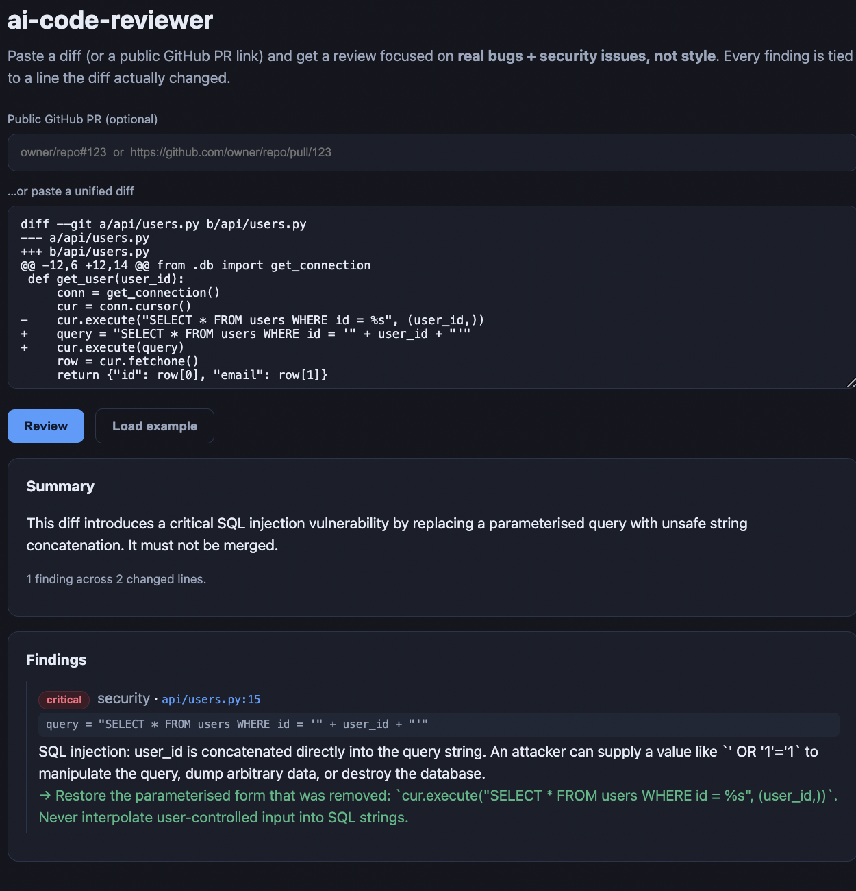

# ai-code-reviewer

### ▶ Live demo: **[reviewer.kareemghazal.com](https://reviewer.kareemghazal.com)**

Paste a diff (or a public GitHub PR ref), hit **Review**, and get findings tied to the
exact lines the diff changed. (First run ~10–20s.)



An AI code reviewer that flags **real bugs and security issues** in a diff or a public
GitHub PR — **not** style nits. Every finding is tied to a line the diff actually
changed, and the whole thing is measured against a **planted-bug test set**.

The hard part of a review bot isn't generating comments — it's **precision**: a bot
that floods a PR with low-value nitpicks gets muted. So this one is built to stay
quiet unless it has something real, and its evals score exactly that.

> Built around one idea: **measure LLM systems, don't vibe them.**

---

## Grounded in the actual diff

The diff is parsed so every changed line carries its **new-file line number**, and the
model is asked to cite that number. Then a **deterministic filter drops any finding
whose line the diff didn't touch** — so the reviewer can't hallucinate a comment on a
line that doesn't exist. Grounding enforced in code, not hoped for in the prompt.

## Focused by design

The prompt forbids style/formatting/naming comments and speculation, and prioritises
**security → bugs/correctness → real performance issues**. If the diff looks safe, it
returns zero findings and says so.

## Evaluation is the product

`evals/` scores the two things a review bot lives or dies on:

- **Recall** — a **planted-bug test set**: diffs with a known bug (SQL injection, a
  None-deref) at a known line. Did the reviewer catch it?
- **Precision** — a **clean diff**: did it stay quiet (no false-positive noise)?
- **LLM judge** — correctness / usefulness / noise (1–5).

```bash
python evals/run_evals.py               # recall + precision + judge
python evals/run_evals.py --no-judge    # deterministic gates only (CI-gateable)
```

**Latest run (claude-sonnet-4-6):** recall 2/2 (both planted bugs caught — a SQL injection and a null-dereference), precision 1/1 (the clean refactor drew zero findings — no crying wolf).

## Quickstart

```bash
pip install -e ".[dev]"
cp .env.example .env          # just ANTHROPIC_API_KEY

ai-review diff --file examples/example.diff          # review a local diff
ai-review pr --ref "psf/requests#6432"               # review a public PR
```

Offline test suite (no key, no network — fake client + fixture diffs):

```bash
pytest -q
```

## Design decisions (the interview-signal section)

- **Diff-grounded findings** — parse new-file line numbers, then filter out any
  finding not on a changed line. Fabrication caught in code.
- **Precision-first prompt** — no style noise; empty result when the diff is clean.
- **Planted-bug evals** — recall/precision measured, not asserted.
- **Works on real PRs** — fetches public PR diffs from GitHub's `.diff` endpoint (no
  token). A CI/webhook integration (post comments on a PR) is a natural next step.

## Web

FastAPI service + Next.js web UI.

Run it locally in two terminals:

```bash
# terminal 1 — the API
pip install -e .
cp .env.example .env                  # add ANTHROPIC_API_KEY
python -m uvicorn ai_code_reviewer.api:app --port 8000

# terminal 2 — the UI
cd web
npm install
echo "NEXT_PUBLIC_API_URL=http://localhost:8000" > .env.local
npm run dev                           # open http://localhost:3000
```

For deployment, see [DEPLOY.md](DEPLOY.md).

## Roadmap
- [x] Diff parser + grounded, structured review (bugs + security, not style)
- [x] Public GitHub PR review via the `.diff` endpoint
- [x] Planted-bug recall + clean-diff precision evals + LLM judge
- [x] FastAPI service + Next.js web UI
- [x] Dockerfile + DEPLOY.md
- [ ] GitHub Action / webhook that posts findings as PR review comments
- [ ] Deploy the live demo

## License
MIT © 2026 Kareem Ghazal
